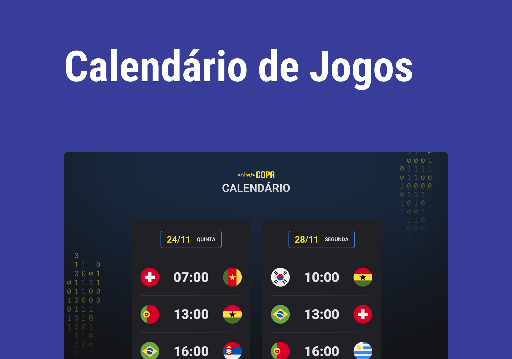

<h1 align="center"> Copa Calendar </h1>

  <a href="#-technologies">Technologies</a>&nbsp;&nbsp;&nbsp;|&nbsp;&nbsp;&nbsp;
  <a href="#-project">Project</a>&nbsp;&nbsp;&nbsp;|&nbsp;&nbsp;&nbsp;
  <a href="#-layout">Layout</a>&nbsp;&nbsp;&nbsp;|&nbsp;&nbsp;&nbsp;
  <a href="#memo-license">License</a>

  

 

  

## 🚀 Technologies

Technologies used in this project:

- HTML, CSS, JavaScript
- JavaScript
- Git and Github

## 💻 Project

The Caledar is a component that simulates the credit card filling form, where you can add mask to inputs and update HTML elements using DOM.

## 🔖 Layout

You can view the project layout through [THIS LINK](https://www.figma.com/file/gpqavL469k0pPUGOmAQEM9/Explorer-Lab-%2301/duplicate). It is necessary to have an account on [Figma](https://figma.com) to access it.

## :memo: License

This project is under the MIT license.

Project developed by the RocketSeat school
